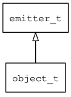

## object\_t
### 概述



 对象接口。


### 函数
<p id="object_t_methods">

| 函数名称 | 说明 | 
| -------- | ------------ | 
| <a href="#object_t_object_compare">object\_compare</a> | 比较两个对象。 |
| <a href="#object_t_object_create">object\_create</a> | 创建对象。 |
| <a href="#object_t_object_foreach_prop">object\_foreach\_prop</a> | 遍历所有属性。 |
| <a href="#object_t_object_get_prop">object\_get\_prop</a> | 获取指定属性的值。 |
| <a href="#object_t_object_ref">object\_ref</a> | 引用计数加1。 |
| <a href="#object_t_object_remove_prop">object\_remove\_prop</a> | 删除指定属性。 |
| <a href="#object_t_object_set_name">object\_set\_name</a> | 设置对象的名称。 |
| <a href="#object_t_object_set_prop">object\_set\_prop</a> | 设置指定属性的值。 |
| <a href="#object_t_object_unref">object\_unref</a> | 引用计数减1。引用计数为0时，销毁对象。 |
### 属性
<p id="object_t_properties">

| 名属性称 | 类型 | 说明 | 
| -------- | ----- | ------------ | 
| <a href="#object_t_name">name</a> | char* | 对象的名称。 |
| <a href="#object_t_ref_count">ref\_count</a> | int32\_t | 引用计数。 |
#### object\_compare 函数
-----------------------

* 函数功能：

> <p id="object_t_object_compare"> 比较两个对象。


* 函数原型：

```
int32_t object_compare (object_t* obj, object_t* other);
```

* 参数说明：

| 参数 | 类型 | 说明 |
| -------- | ----- | --------- |
| 返回值 | int32\_t | 返回比较结果。 |
| obj | object\_t* | object对象。 |
| other | object\_t* | 比较的object对象。 |
#### object\_create 函数
-----------------------

* 函数功能：

> <p id="object_t_object_create"> 创建对象。

 > 仅供子类调用。


* 函数原型：

```
ret_t object_create (const object_vtable_t* vt);
```

* 参数说明：

| 参数 | 类型 | 说明 |
| -------- | ----- | --------- |
| 返回值 | ret\_t | 返回object对象。 |
| vt | const object\_vtable\_t* | 虚函数表。 |
#### object\_foreach\_prop 函数
-----------------------

* 函数功能：

> <p id="object_t_object_foreach_prop"> 遍历所有属性。


* 函数原型：

```
ret_t object_foreach_prop (object_t* obj, tk_visit_t on_prop, void* ctx);
```

* 参数说明：

| 参数 | 类型 | 说明 |
| -------- | ----- | --------- |
| 返回值 | ret\_t | 返回RET\_OK表示成功，否则表示失败。 |
| obj | object\_t* | object对象。 |
| on\_prop | tk\_visit\_t | 回调函数。 |
| ctx | void* | 回调函数上下文。 |
#### object\_get\_prop 函数
-----------------------

* 函数功能：

> <p id="object_t_object_get_prop"> 获取指定属性的值。


* 函数原型：

```
ret_t object_get_prop (object_t* obj, const char* name, value_t* v);
```

* 参数说明：

| 参数 | 类型 | 说明 |
| -------- | ----- | --------- |
| 返回值 | ret\_t | 返回RET\_OK表示成功，否则表示失败。 |
| obj | object\_t* | object对象。 |
| name | const char* | 属性的名称。 |
| v | value\_t* | 返回属性的值。 |
#### object\_ref 函数
-----------------------

* 函数功能：

> <p id="object_t_object_ref"> 引用计数加1。


* 函数原型：

```
object_t* object_ref (object_t* obj);
```

* 参数说明：

| 参数 | 类型 | 说明 |
| -------- | ----- | --------- |
| 返回值 | object\_t* | 返回object对象。 |
| obj | object\_t* | object对象。 |
#### object\_remove\_prop 函数
-----------------------

* 函数功能：

> <p id="object_t_object_remove_prop"> 删除指定属性。


* 函数原型：

```
ret_t object_remove_prop (object_t* obj, const char* name);
```

* 参数说明：

| 参数 | 类型 | 说明 |
| -------- | ----- | --------- |
| 返回值 | ret\_t | 返回RET\_OK表示成功，否则表示失败。 |
| obj | object\_t* | object对象。 |
| name | const char* | 属性的名称。 |
#### object\_set\_name 函数
-----------------------

* 函数功能：

> <p id="object_t_object_set_name"> 设置对象的名称。


* 函数原型：

```
ret_t object_set_name (object_t* obj, const char* name);
```

* 参数说明：

| 参数 | 类型 | 说明 |
| -------- | ----- | --------- |
| 返回值 | ret\_t | 返回RET\_OK表示成功，否则表示失败。 |
| obj | object\_t* | object对象。 |
| name | const char* | 对象的名称。 |
#### object\_set\_prop 函数
-----------------------

* 函数功能：

> <p id="object_t_object_set_prop"> 设置指定属性的值。


* 函数原型：

```
ret_t object_set_prop (object_t* obj, const char* name, value_t* v);
```

* 参数说明：

| 参数 | 类型 | 说明 |
| -------- | ----- | --------- |
| 返回值 | ret\_t | 返回RET\_OK表示成功，否则表示失败。 |
| obj | object\_t* | object对象。 |
| name | const char* | 属性的名称。 |
| v | value\_t* | 属性的值。 |
#### object\_unref 函数
-----------------------

* 函数功能：

> <p id="object_t_object_unref"> 引用计数减1。引用计数为0时，销毁对象。


* 函数原型：

```
ret_t object_unref (object_t* obj);
```

* 参数说明：

| 参数 | 类型 | 说明 |
| -------- | ----- | --------- |
| 返回值 | ret\_t | 返回RET\_OK表示成功，否则表示失败。 |
| obj | object\_t* | object对象。 |
#### name 属性
-----------------------
> <p id="object_t_name"> 对象的名称。


* 类型：char*

| 特性 | 是否支持 |
| -------- | ----- |
| 可直接读取 | 是 |
| 可直接修改 | 否 |
| 可脚本化   | 是 |
#### ref\_count 属性
-----------------------
> <p id="object_t_ref_count"> 引用计数。


* 类型：int32\_t

| 特性 | 是否支持 |
| -------- | ----- |
| 可直接读取 | 是 |
| 可直接修改 | 否 |
| 可脚本化   | 是 |
