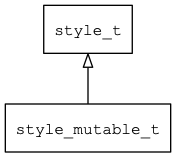

## style\_mutable\_t
### 概述



 可变的style(可实时修改并生效，主要用于在designer中被编辑的控件，或者一些特殊控件)。

 style\_mutable也对style\_const进行了包装，当用户没修改某个值时，便从style\_const中获取。


----------------------------------
### 函数
<p id="style_mutable_t_methods">

| 函数名称 | 说明 | 
| -------- | ------------ | 
| <a href="#style_mutable_t_style_mutable_create">style\_mutable\_create</a> | 创建style\_mutable对象。 |
| <a href="#style_mutable_t_style_mutable_foreach">style\_mutable\_foreach</a> | 遍历。对每项调用回调函数on\_style\_item。 |
| <a href="#style_mutable_t_style_mutable_get_name">style\_mutable\_get\_name</a> | 获取style的名称。 |
| <a href="#style_mutable_t_style_mutable_register">style\_mutable\_register</a> | 将自己注册到style\_factory。 |
| <a href="#style_mutable_t_style_mutable_set_color">style\_mutable\_set\_color</a> | 设置指定name的颜色值。 |
| <a href="#style_mutable_t_style_mutable_set_int">style\_mutable\_set\_int</a> | 设置指定name整数格式的值。 |
| <a href="#style_mutable_t_style_mutable_set_name">style\_mutable\_set\_name</a> | 设置style的名称。 |
| <a href="#style_mutable_t_style_mutable_set_str">style\_mutable\_set\_str</a> | 设置指定name字符串的值。 |
### 属性
<p id="style_mutable_t_properties">

| 属性名称 | 类型 | 说明 | 
| -------- | ----- | ------------ | 
| <a href="#style_mutable_t_name">name</a> | char* | 名称。 |
#### style\_mutable\_create 函数
-----------------------

* 函数功能：

> <p id="style_mutable_t_style_mutable_create"> 创建style\_mutable对象。

 > 除了测试程序外不需要直接调用，widget会通过style\_factory\_create创建。


* 函数原型：

```
style_t* style_mutable_create (widget_t* widget);
```

* 参数说明：

| 参数 | 类型 | 说明 |
| -------- | ----- | --------- |
| 返回值 | style\_t* | style对象。 |
| widget | widget\_t* | 控件 |
#### style\_mutable\_foreach 函数
-----------------------

* 函数功能：

> <p id="style_mutable_t_style_mutable_foreach"> 遍历。对每项调用回调函数on\_style\_item。


* 函数原型：

```
ret_t style_mutable_foreach (style_t* s, tk_on_style_item_t on_style_item, void* ctx);
```

* 参数说明：

| 参数 | 类型 | 说明 |
| -------- | ----- | --------- |
| 返回值 | ret\_t | 返回RET\_OK表示成功，否则表示失败。 |
| s | style\_t* | style对象。 |
| on\_style\_item | tk\_on\_style\_item\_t | 回调函数。 |
| ctx | void* | 回调函数的上下文。 |
#### style\_mutable\_get\_name 函数
-----------------------

* 函数功能：

> <p id="style_mutable_t_style_mutable_get_name"> 获取style的名称。


* 函数原型：

```
const char* style_mutable_get_name (style_t* s);
```

* 参数说明：

| 参数 | 类型 | 说明 |
| -------- | ----- | --------- |
| 返回值 | const char* | style的名称。 |
| s | style\_t* | style对象。 |
#### style\_mutable\_register 函数
-----------------------

* 函数功能：

> <p id="style_mutable_t_style_mutable_register"> 将自己注册到style\_factory。


* 函数原型：

```
ret_t style_mutable_register ();
```

* 参数说明：

| 参数 | 类型 | 说明 |
| -------- | ----- | --------- |
| 返回值 | ret\_t | 返回RET\_OK表示成功，否则表示失败。 |
#### style\_mutable\_set\_color 函数
-----------------------

* 函数功能：

> <p id="style_mutable_t_style_mutable_set_color"> 设置指定name的颜色值。


* 函数原型：

```
ret_t style_mutable_set_color (style_t* s, const char* state, const char* name, color_t val);
```

* 参数说明：

| 参数 | 类型 | 说明 |
| -------- | ----- | --------- |
| 返回值 | ret\_t | 返回RET\_OK表示成功，否则表示失败。 |
| s | style\_t* | style对象。 |
| state | const char* | 控件状态。 |
| name | const char* | 属性名。 |
| val | color\_t | 值。 |
#### style\_mutable\_set\_int 函数
-----------------------

* 函数功能：

> <p id="style_mutable_t_style_mutable_set_int"> 设置指定name整数格式的值。


* 函数原型：

```
ret_t style_mutable_set_int (style_t* s, const char* state, const char* name, int32_t val);
```

* 参数说明：

| 参数 | 类型 | 说明 |
| -------- | ----- | --------- |
| 返回值 | ret\_t | 返回RET\_OK表示成功，否则表示失败。 |
| s | style\_t* | style对象。 |
| state | const char* | 控件状态。 |
| name | const char* | 属性名。 |
| val | int32\_t | 值。 |
#### style\_mutable\_set\_name 函数
-----------------------

* 函数功能：

> <p id="style_mutable_t_style_mutable_set_name"> 设置style的名称。


* 函数原型：

```
ret_t style_mutable_set_name (style_t* s, const char* name);
```

* 参数说明：

| 参数 | 类型 | 说明 |
| -------- | ----- | --------- |
| 返回值 | ret\_t | 返回RET\_OK表示成功，否则表示失败。 |
| s | style\_t* | style对象。 |
| name | const char* | 名称。 |
#### style\_mutable\_set\_str 函数
-----------------------

* 函数功能：

> <p id="style_mutable_t_style_mutable_set_str"> 设置指定name字符串的值。


* 函数原型：

```
ret_t style_mutable_set_str (style_t* s, const char* state, const char* name, const char* val);
```

* 参数说明：

| 参数 | 类型 | 说明 |
| -------- | ----- | --------- |
| 返回值 | ret\_t | 返回RET\_OK表示成功，否则表示失败。 |
| s | style\_t* | style对象。 |
| state | const char* | 控件状态。 |
| name | const char* | 属性名。 |
| val | const char* | 值。 |
#### name 属性
-----------------------
> <p id="style_mutable_t_name"> 名称。


* 类型：char*

| 特性 | 是否支持 |
| -------- | ----- |
| 可直接读取 | 是 |
| 可直接修改 | 否 |
| 可脚本化   | 是 |
