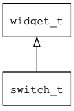

## switch\_t
### 概述


 开关控件。

 switch\_t是[widget\_t](widget_t.md)的子类控件，widget\_t的函数均适用于switch\_t控件。

 在xml中使用"switch"标签创建开关控件。如：

 ```xml
 <switch x="10" y="60" w="60" h="22" />
 ```

 > 更多用法请参考：[switch.xml](
 https://github.com/zlgopen/awtk/blob/master/demos/assets/raw/ui/switch.xml)

 在c代码中使用函数switch\_create创建开关控件。如：

 ```c
  widget_t* sw = switch_create(win, 10, 10, 80, 30);
  widget_on(sw, EVT_VALUE_CHANGED, on_changed, NULL);
 ```

 > 完整示例请参考：[switch demo](
 https://github.com/zlgopen/awtk-c-demos/blob/master/demos/switch.c)

 可用通过style来设置控件的显示风格，如背景图片等。如：

 ```xml
 <style name="default">
   <normal  bg_image="switch" />
 </style>
 ```

 > 更多用法请参考：[theme default](
 https://github.com/zlgopen/awtk/blob/master/demos/assets/raw/styles/default.xml#L452)


----------------------------------
### 函数
<p id="switch_t_methods">

| 函数名称 | 说明 | 
| -------- | ------------ | 
| <a href="#switch_t_switch_cast">switch\_cast</a> | 转换switch对象(供脚本语言使用)。 |
| <a href="#switch_t_switch_create">switch\_create</a> | 创建switch对象 |
| <a href="#switch_t_switch_set_value">switch\_set\_value</a> | 设置控件的值。 |
### 属性
<p id="switch_t_properties">

| 属性名称 | 类型 | 说明 | 
| -------- | ----- | ------------ | 
| <a href="#switch_t_max_xoffset_ratio">max\_xoffset\_ratio</a> | float\_t | 当开关处于关闭时，图片偏移相对于图片宽度的比例(缺省为1/3)。 |
| <a href="#switch_t_round_radius">round\_radius</a> | int32\_t | 图片的圆角半径。 |
| <a href="#switch_t_value">value</a> | bool\_t | 值。 |
### 事件
<p id="switch_t_events">

| 事件名称 | 类型  | 说明 | 
| -------- | ----- | ------- | 
| EVT\_VALUE\_WILL\_CHANGE | event\_t | 值(开关状态)即将改变事件。 |
| EVT\_VALUE\_CHANGED | event\_t | 值(开关状态)改变事件。 |
#### switch\_cast 函数
-----------------------

* 函数功能：

> <p id="switch_t_switch_cast"> 转换switch对象(供脚本语言使用)。


* 函数原型：

```
widget_t* switch_cast (widget_t* widget);
```

* 参数说明：

| 参数 | 类型 | 说明 |
| -------- | ----- | --------- |
| 返回值 | widget\_t* | switch对象。 |
| widget | widget\_t* | switch对象。 |
#### switch\_create 函数
-----------------------

* 函数功能：

> <p id="switch_t_switch_create"> 创建switch对象


* 函数原型：

```
widget_t* switch_create (widget_t* parent, xy_t x, xy_t y, wh_t w, wh_t h);
```

* 参数说明：

| 参数 | 类型 | 说明 |
| -------- | ----- | --------- |
| 返回值 | widget\_t* | 对象。 |
| parent | widget\_t* | 父控件 |
| x | xy\_t | x坐标 |
| y | xy\_t | y坐标 |
| w | wh\_t | 宽度 |
| h | wh\_t | 高度 |
#### switch\_set\_value 函数
-----------------------

* 函数功能：

> <p id="switch_t_switch_set_value"> 设置控件的值。


* 函数原型：

```
ret_t switch_set_value (widget_t* widget, bool_t value);
```

* 参数说明：

| 参数 | 类型 | 说明 |
| -------- | ----- | --------- |
| 返回值 | ret\_t | 返回RET\_OK表示成功，否则表示失败。 |
| widget | widget\_t* | switch对象。 |
| value | bool\_t | 值 |
#### max\_xoffset\_ratio 属性
-----------------------
> <p id="switch_t_max_xoffset_ratio"> 当开关处于关闭时，图片偏移相对于图片宽度的比例(缺省为1/3)。


* 类型：float\_t

| 特性 | 是否支持 |
| -------- | ----- |
| 可直接读取 | 是 |
| 可直接修改 | 否 |
| 可持久化   | 是 |
| 可脚本化   | 是 |
| 可在IDE中设置 | 是 |
| 可在XML中设置 | 是 |
| 可通过widget\_get\_prop读取 | 是 |
| 可通过widget\_set\_prop修改 | 是 |
#### round\_radius 属性
-----------------------
> <p id="switch_t_round_radius"> 图片的圆角半径。


* 类型：int32\_t

| 特性 | 是否支持 |
| -------- | ----- |
| 可直接读取 | 是 |
| 可直接修改 | 否 |
| 可持久化   | 是 |
| 可脚本化   | 是 |
| 可在IDE中设置 | 是 |
| 可在XML中设置 | 是 |
| 可通过widget\_get\_prop读取 | 是 |
| 可通过widget\_set\_prop修改 | 是 |
#### value 属性
-----------------------
> <p id="switch_t_value"> 值。


* 类型：bool\_t

| 特性 | 是否支持 |
| -------- | ----- |
| 可直接读取 | 是 |
| 可直接修改 | 否 |
| 可持久化   | 是 |
| 可脚本化   | 是 |
| 可在IDE中设置 | 是 |
| 可在XML中设置 | 是 |
| 可通过widget\_get\_prop读取 | 是 |
| 可通过widget\_set\_prop修改 | 是 |
